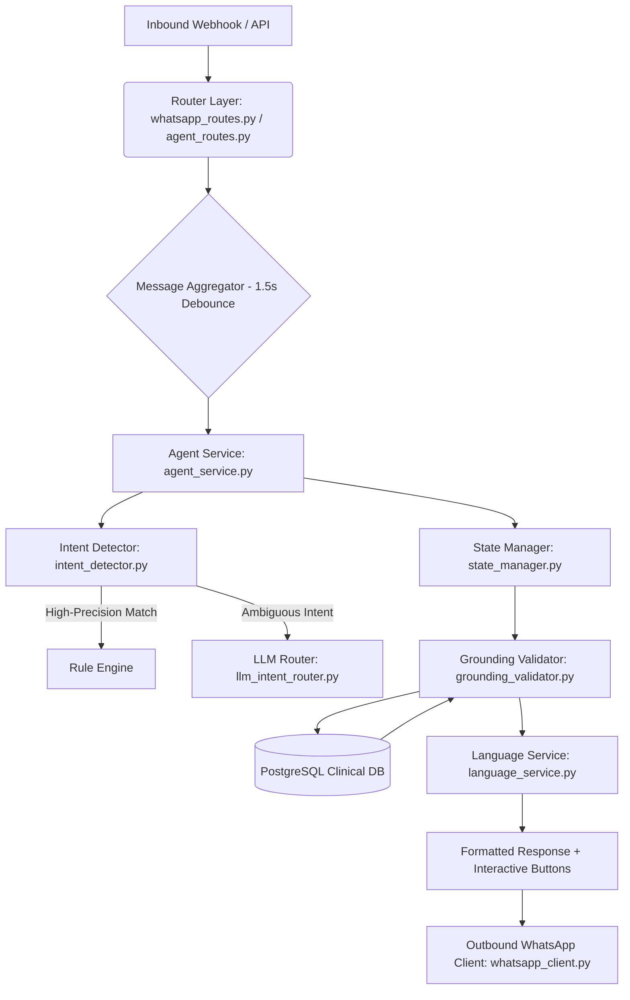

# MERIDIAN HOSPITAL — AI PATIENT DESK & WHATSAPP CONVERSATIONAL AI
## Technical Appendix & System Specification

---

> **TECHNICAL GOVERNANCE & ARCHITECTURE REFERENCE**  
> **Target Audience:** Chief Information Officer (CIO), Chief Technology Officer (CTO), Lead Engineers, IT Systems Administrators, & Security Auditors  
> **System Name:** Meridian AI Patient Desk (WhatsApp Conversational AI Engine)  
> **Document Version:** 2.1.0  

---

## TABLE OF CONTENTS
1. [Repository & Directory Structure](#1-repository--directory-structure)
2. [Frontend Component Architecture](#2-frontend-component-architecture)
3. [Backend Architecture & Module Breakdown](#3-backend-architecture--module-breakdown)
4. [API Endpoints & Data Schemas](#4-api-endpoints--data-schemas)
5. [Database Entities & PostgreSQL Schemas](#5-database-entities--postgresql-schemas)
6. [Conversation State Machine & Stage Transitions](#6-conversation-state-machine--stage-transitions)
7. [Meta WhatsApp Cloud API Integration Architecture](#7-meta-whatsapp-cloud-api-integration-architecture)
8. [Voice Processing Subsystem (STT / TTS)](#8-voice-processing-subsystem-stt--tts)
9. [Configuration & Environment Setup](#9-configuration--environment-setup)
10. [Production Readiness & Gap Analysis](#10-production-readiness--gap-analysis)

---

## 1. REPOSITORY & DIRECTORY STRUCTURE

The project follows a standard decoupled full-stack monorepo architecture:

```
health-care/
├── backend/                        # Python FastAPI Backend & Conversational AI Engine
│   ├── main.py                     # FastAPI application entry point, CORS, routers mount
│   ├── db_config.py                # PostgreSQL connection pooling & database config
│   ├── models.py                   # Pydantic data models & request/response schemas
│   ├── appointment_service.py      # Core OPD appointment business logic & slot validation
│   ├── preadmission_service.py     # Pre-admission intake & document preparation service
│   ├── seed_pg_data.py             # PostgreSQL database seeding script (Departments, Doctors, Patients)
│   ├── agent/                      # Conversational AI Agent Core Architecture
│   │   ├── agent_service.py        # Master agent coordinator & conversation orchestrator (10k+ lines)
│   │   ├── conversation_stages.py  # Explicit 24-stage state machine definitions & stage rules
│   │   ├── intent_detector.py      # Multi-language regex pattern matcher (Priority 0/1/2)
│   │   ├── intent_router.py        # Deterministic intent dispatch router
│   │   ├── llm_intent_router.py    # LLM fallback router for ambiguous conversational requests
│   │   ├── entity_extractor.py     # Named Entity Recognition (NER) for dates, doctors, symptoms
│   │   ├── language_service.py     # Translation bundles for 7 languages (EN, TA, HI, TE, ML, KN, UR)
│   │   ├── grounding_validator.py  # Anti-hallucination database validator
│   │   ├── date_normalizer.py      # Relative date & DOB parser/normalizer
│   │   ├── patient_identification_service.py # WhatsApp number & Patient Code matcher
│   │   ├── state_manager.py        # State persistence & clear/carry rules engine
│   │   └── response_validator.py   # Response formatting & WhatsApp button normalizer
│   ├── api/                        # REST API Router Endpoints
│   │   ├── agent_routes.py         # `/api/agent/chat` and `/api/agent/voice/process`
│   │   ├── whatsapp_routes.py      # Meta WhatsApp Cloud API Webhook (`/api/whatsapp/webhook`)
│   │   ├── dashboard_routes.py     # Command desk analytics & operational metrics
│   │   └── auth_routes.py          # Staff authentication & session handler
│   ├── voice/                      # Multimodal Voice Subsystem
│   │   ├── speech_to_text.py       # Whisper / Speech recognition transcriber
│   │   ├── text_to_speech.py       # Text-to-speech audio synthesizer
│   │   ├── voice_service.py        # Voice file upload orchestrator
│   │   └── whatsapp_client.py      # Outbound Meta WhatsApp HTTP media uploader & sender
│   └── db/                         # PostgreSQL Migrations & Table Initialization Scripts
│       ├── init_pg_tables.py       # DB Schema DDL initialization script
│       └── init_clinical_tables.py # Clinical tables schema definitions
├── frontend/                       # React 18 + Vite Web Application & Simulators
│   ├── src/
│   │   ├── App.jsx                 # Primary layout container & view router
│   │   ├── pages/
│   │   │   ├── PatientChat.tsx     # WhatsApp Web Liquid-Glass Simulator UI
│   │   │   └── admin/              # Command Desk Admin Pages
│   │   │       ├── AIPatientDesk.jsx # Real-time patient desk dashboard
│   │   │       ├── AppointmentManagement.jsx # OPD Appointment schedule manager
│   │   │       └── DoctorSchedules.jsx # Doctor availability manager
│   │   ├── components/
│   │   │   ├── IOSFrame.jsx        # Mobile frame simulator wrapper
│   │   │   └── MobileSimulatorModal.jsx # Floating test drawer
│   │   └── services/
│   │       └── api.js              # Axios / Fetch client for API communication
├── docs/                           # Documentation Root
└── RADIOLOGY_INTEGRATION.md        # Specialized sub-module documentation
```

---

## 2. FRONTEND COMPONENT ARCHITECTURE

The frontend is constructed using React 18 and Vite.

### Core Component Highlights:
- **`PatientChat.tsx`**: Simulates the WhatsApp client interface inside an iOS 26 liquid glass aesthetic container.
  - Implements stateful chat message queues (`ChatMessage[]`).
  - Supports interactive buttons (up to 3 actions per card) and list option modal drawers.
  - Features real-time voice recording via browser `MediaRecorder` API, sending audio via `Multipart/Form-Data` to `/api/agent/voice/process`.
  - Displays quick-action sidebar buttons for instant navigation across core hospital services.
- **`AIPatientDesk.jsx`**: Hospital operator command desk interface displaying active patient chats, pending escalations, and real-time conversation metrics.

---

## 3. BACKEND ARCHITECTURE & MODULE BREAKDOWN

The backend relies on FastAPI with asynchronous event handling and PostgreSQL database pooling via `psycopg2` / `db_config.py`.



---

## 4. API ENDPOINTS & DATA SCHEMAS

### 1. Agent Text Chat (`POST /api/agent/chat`)
#### Request Payload Schema (`AgentChatRequest`):
```json
{
  "conversation_id": "CONV_919876543210",
  "patient_id": "P001",
  "message": "Book cardiology appointment for tomorrow afternoon",
  "language": "ENGLISH",
  "button_id": null,
  "interactive_id": null
}
```

#### Response Payload Schema (`AgentChatResponse`):
```json
{
  "success": true,
  "conversation_id": "CONV_919876543210",
  "language": "ENGLISH",
  "intent": "BOOK_APPOINTMENT",
  "response": "Here are the available Cardiology slots for Dr. Priya Ramesh tomorrow (26-Oct-2026):\n\n1. 02:00 PM\n2. 02:30 PM\n3. 03:00 PM\n\nWhich slot would you prefer?",
  "missing_information": ["appointment_time"],
  "tool_called": "get_available_slots",
  "interactive_buttons": [
    { "id": "btn_time_14_00", "title": "02:00 PM" },
    { "id": "btn_time_14_30", "title": "02:30 PM" },
    { "id": "btn_time_15_00", "title": "03:00 PM" }
  ],
  "interactive_type": "button_reply"
}
```

### 2. Voice Process Endpoint (`POST /api/agent/voice/process`)
- **Headers**: `Content-Type: multipart/form-data`
- **Body Fields**: `audio` (file binary), `session_id` (string), `patient_code` (optional string), `language` (optional string).
- **Response**: Returns transcript text, detected intent, response text, and base64-encoded audio payload (`audio`).

---

## 5. DATABASE ENTITIES & POSTGRESQL SCHEMAS

The system operates on PostgreSQL with `pgvector` enabled for embedding storage.

```sql
-- 1. Departments Master Table
CREATE TABLE departments (
    id SERIAL PRIMARY KEY,
    department_code VARCHAR(20) UNIQUE NOT NULL,
    department_name VARCHAR(100) NOT NULL,
    description TEXT,
    status VARCHAR(20) DEFAULT 'ACTIVE'
);

-- 2. Doctors Master Table
CREATE TABLE doctors (
    id SERIAL PRIMARY KEY,
    doctor_code VARCHAR(20) UNIQUE NOT NULL,
    user_id INT REFERENCES users(id),
    department_id INT REFERENCES departments(id),
    first_name VARCHAR(50) NOT NULL,
    last_name VARCHAR(50) NOT NULL,
    display_name VARCHAR(100) NOT NULL,
    specialization VARCHAR(100),
    consultation_fee NUMERIC(10,2) NOT NULL,
    status VARCHAR(20) DEFAULT 'ACTIVE'
);

-- 3. Doctor Schedules Table
CREATE TABLE doctor_schedules (
    id SERIAL PRIMARY KEY,
    doctor_id INT REFERENCES doctors(id),
    day_of_week VARCHAR(15) NOT NULL, -- MONDAY, TUESDAY, etc.
    start_time TIME NOT NULL,
    end_time TIME NOT NULL,
    slot_duration_minutes INT DEFAULT 30,
    status VARCHAR(20) DEFAULT 'ACTIVE'
);

-- 4. Patients Master Table
CREATE TABLE patients (
    id SERIAL PRIMARY KEY,
    patient_code VARCHAR(20) UNIQUE NOT NULL,
    first_name VARCHAR(50) NOT NULL,
    last_name VARCHAR(50) NOT NULL,
    dob DATE,
    gender VARCHAR(10),
    phone VARCHAR(20) NOT NULL,
    whatsapp_number VARCHAR(20),
    email VARCHAR(100)
);

-- 5. Appointments Table
CREATE TABLE appointments (
    id SERIAL PRIMARY KEY,
    booking_id VARCHAR(30) UNIQUE NOT NULL,
    patient_id INT REFERENCES patients(id),
    doctor_id INT REFERENCES doctors(id),
    department_id INT REFERENCES departments(id),
    appointment_date DATE NOT NULL,
    appointment_time TIME NOT NULL,
    status VARCHAR(20) DEFAULT 'BOOKED', -- BOOKED, RESCHEDULED, CANCELLED, COMPLETED
    created_at TIMESTAMP DEFAULT CURRENT_TIMESTAMP
);
```

---

## 6. CONVERSATION STATE MACHINE & STAGE TRANSITIONS

State transitions are strictly evaluated inside `agent/conversation_stages.py` using the `Stage` enum.

```
┌────────────────────────────────────────────────────────────────────────────────────────┐
│                              STRICT 24-STAGE STATE ENUM                                │
├──────────────────────────┬──────────────────────────┬──────────────────────────────────┤
│ CATEGORY                 │ STAGE NAME               │ DESCRIPTION / EXPECTED ENTRY     │
├──────────────────────────┼──────────────────────────┼──────────────────────────────────┤
│ Session Start            │ NEW                      │ Uninitialized conversation       │
│                          │ GREETING                 │ Session started with greeting    │
├──────────────────────────┼──────────────────────────┼──────────────────────────────────┤
│ OPD Booking Lifecycle    │ AWAITING_REASON          │ Waiting for symptom/specialty    │
│                          │ AWAITING_DEPT_CONFIRM    │ Waiting for dept selection       │
│                          │ AWAITING_DOCTOR          │ Waiting for doctor selection     │
│                          │ AWAITING_DATE            │ Waiting for appointment date     │
│                          │ AWAITING_TIME            │ Waiting for time slot selection  │
│                          │ AWAITING_CONFIRMATION    │ Waiting for booking confirmation │
├──────────────────────────┼──────────────────────────┼──────────────────────────────────┤
│ Registration Lifecycle   │ REGISTERING_NAME         │ Collecting patient name          │
│                          │ REGISTERING_DOB          │ Collecting date of birth         │
│                          │ REGISTERING_GENDER       │ Collecting gender                │
│                          │ REGISTERING_PHONE        │ Collecting contact phone         │
│                          │ REGISTRATION_CONFIRMING  │ Confirming patient registration  │
├──────────────────────────┼──────────────────────────┼──────────────────────────────────┤
│ Modify / Cancel          │ AWAITING_CANCEL_CONFIRM  │ Waiting for cancellation confirm │
│                          │ AWAITING_RESCHEDULE_DATE │ Waiting for new date selection   │
│                          │ AWAITING_RESCHEDULE_TIME │ Waiting for new time selection   │
├──────────────────────────┼──────────────────────────┼──────────────────────────────────┤
│ Terminal                 │ COMPLETE                 │ Action successfully committed    │
└──────────────────────────┴──────────────────────────┴──────────────────────────────────┘
```

---

## 7. META WHATSAPP CLOUD API INTEGRATION ARCHITECTURE

The integration module (`api/whatsapp_routes.py`) manages bidirectional communication with Meta Cloud API:

- **Verification Endpoint**: `GET /api/whatsapp/webhook` handles token verification (`hub.verify_token`).
- **Delivery Endpoint**: `POST /api/whatsapp/webhook` decodes incoming JSON payloads from Meta servers.
- **Message Aggregation**: Implements a 1.5-second to 3.0-second debounce window (`message_aggregator.py`) to gather multiple rapid messages sent by a user into a single cohesive turn.
- **Outbound Media & Text**: `voice/whatsapp_client.py` constructs standard Meta payload structures for text, interactive button objects, list components, and voice audio media objects.

---

## 8. VOICE PROCESSING SUBSYSTEM (STT / TTS)

```
[ Inbound Voice Audio (.ogg/.mp3) ]
               │
               ▼
   [ voice/speech_to_text.py ] ──> Speech-to-Text Transcription
               │
               ▼
    [ agent/agent_service.py ] ──> Natural Language Understanding & State Execution
               │
               ▼
   [ voice/text_to_speech.py ] ──> Synthesizes Response Audio Payload
               │
               ▼
[ Outbound Audio & Text Payload ]
```

---

## 9. CONFIGURATION & ENVIRONMENT SETUP

Environment variables are specified inside `backend/.env`:

```env
# Server Config
PORT=8000
HOST=0.0.0.0

# PostgreSQL Clinical Database
POSTGRES_DB=health_care
POSTGRES_USER=postgres
POSTGRES_PASSWORD=******
POSTGRES_HOST=localhost
POSTGRES_PORT=5432

# Meta WhatsApp Cloud API Config
META_WHATSAPP_TOKEN=******
META_WHATSAPP_PHONE_NUMBER_ID=******
META_WHATSAPP_VERIFY_TOKEN=meridian_hospital_token
META_APP_SECRET=******

# LLM Provider Credentials
OPENAI_API_KEY=******
AZURE_OPENAI_ENDPOINT=******
```

---

## 10. PRODUCTION READINESS & GAP ANALYSIS

| Technical Subsystem | Current Implementation | Production Gap / Requirement |
| :--- | :--- | :--- |
| **Data Layer** | Seeded PostgreSQL DB (`seed_pg_data.py`) | Connect to real Meridian HIS/EMR database |
| **WhatsApp Channel** | Meta Cloud Sandbox API & iOS Simulator | Register production WABA & verified business phone |
| **Authentication** | Basic Session Tokens | OAuth2 / OpenID Connect with Hospital SSO |
| **LLM Inference** | API Keys & Fallback Engine | Enterprise LLM Endpoint with low latency SLA |
| **Voice Engine** | Lightweight STT/TTS Drivers | Cloud Speech Services (Azure Speech / GCP Speech-to-Text) |

---
*End of Technical Appendix — Meridian Hospital IT Architecture Reference*
