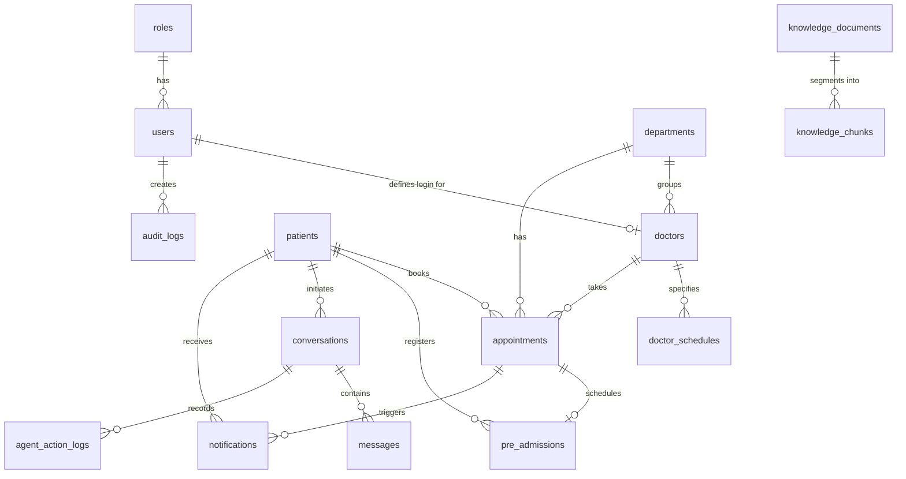

# Meridian Hospital POC Database Documentation

This document explains the installation, configuration, migrations, seed data, and testing of the PostgreSQL database for the Meridian Hospital Conversational Patient Desk and WhatsApp/Voice Agent POC.

---

## 1. PostgreSQL Installation & Configuration

### Prerequisites
1. **PostgreSQL Server**: Install PostgreSQL (version 12 or above recommended).
2. **pgvector Extension**: The POC utilizes `pgvector` for storing and retrieving knowledge embeddings. Ensure the `pgvector` extension is installed.
   - For Windows, pre-compiled binaries are available, or you can install it using package managers.
   - For Docker, use `pgvector/pgvector` image.

### Service Port
By default, the PostgreSQL service is configured to run on:
- **Host**: `localhost`
- **Port**: `5433` (or the default PostgreSQL port `5432` based on configuration)

---

## 2. Environment Variables

The backend application uses environment variables for database configurations. These variables are defined in the `.env` file at the root of the `backend` directory.

### Setup
1. Copy the example environment template:
   ```bash
   cp backend/.env.example backend/.env
   ```
2. Open `backend/.env` and update the database connection details as required:
   ```env
   DATABASE_HOST=localhost
   DATABASE_PORT=5433
   DATABASE_NAME=healthcare
   DATABASE_USER=postgres
   DATABASE_PASSWORD=reji123@
   ```

---

## 3. Running Migrations

Database tables are managed using SQL migration files found under [backend/migrations](file:///c:/Users/Bsoft137/OneDrive/Documents/AI_Conversational_Patient_Desk/Healthcare-Prototype/backend/migrations).

To create the database and run migrations from scratch:
```bash
python backend/run_migrations.py
```

### Migrations executed in order:
1. `001_create_roles`: Defines roles (`ADMIN`, `DOCTOR`).
2. `002_create_users`: Defines system users, password hashes, and active flags.
3. `003_create_patients`: Patient registry master details.
4. `004_create_departments`: Clinical departments master registry.
5. `005_create_doctors`: Doctor professional profile credentials linked to system users.
6. `006_create_doctor_schedules`: Time availabilities of doctors.
7. `007_create_appointments`: Doctor slots booking master registry. Includes partial index to prevent double bookings.
8. `008_create_pre_admissions`: Expected surgical/daycare stay information.
9. `009_create_conversations`: Active patient chat sessions.
10. `010_create_messages`: Dialogue texts, voice paths, metadata logs.
11. `011_create_notifications`: WhatsApp/Email reminders and logs.
12. `012_create_audit_logs`: Audit trail for records management.
13. `013_create_knowledge_documents`: Base hospital documents database.
14. `014_create_knowledge_chunks`: Segmented document texts mapped with `vector(1536)` embeddings.
15. `015_create_agent_action_logs`: Logs execution of tools and APIs by the AI Agent.

---

## 4. Seeding Sample Data

To populate the database tables with synthetic Meridian Hospital records:
```bash
python backend/seed_pg_data.py
```

The seed script populates:
- **1 Admin Account**: `admin` / `admin` (hashed)
- **2 Doctor Accounts**: `doc1` / `doc1`, `doc2` / `doc2` (hashed)
- **2 Doctor Profiles**: Dr. Arun Kumar (General Medicine) and Dr. Priya Ramesh (Cardiology)
- **8 Departments**: General Medicine, Cardiology, Pediatrics, Orthopedics, Dermatology, ENT, Gynecology, Neurology
- **10 Patients**: Fictional patient registries with contact info, emergency contacts, and blood groups.
- **Schedules**: Weekly recurring available slots.
- **11 Appointments**: Ranging from BOOKED, CONFIRMED, COMPLETED, CANCELLED, to RESCHEDULED.
- **3 Pre-Admissions**: Patient stays and document checklist logs.
- **RAG resources**: Knowledge documents and chunks mapped with 1536-dimensional float vector embeddings.
- **Conversations, Messages, Notifications, Audit Logs, and Agent Action Logs**.

---

## 5. Automated Verification

An automated verification script is available to assert database schema, count checks, join relationships, and constraint boundaries.

Run the verification test suite:
```bash
python backend/verify_db.py
```

---

## 6. Table & Relationship Structure

The relational database diagram mapping is shown below:



---

## 7. Useful SQL Queries

Here are example queries for verification and management:

### Check Registered Patients
```sql
SELECT patient_code, first_name, last_name, phone, blood_group, status 
FROM patients;
```

### View Doctor Profiles & Departments
```sql
SELECT d.doctor_code, d.display_name, dept.department_name, d.specialization, d.consultation_fee 
FROM doctors d
JOIN departments dept ON d.department_id = dept.id;
```

### View Active Appointments
```sql
SELECT a.booking_id, p.first_name || ' ' || p.last_name AS patient_name, d.display_name AS doctor_name, a.appointment_date, a.appointment_time, a.status
FROM appointments a
JOIN patients p ON a.patient_id = p.id
JOIN doctors d ON a.doctor_id = d.id
WHERE a.status NOT IN ('CANCELLED', 'RESCHEDULED');
```

### Query Knowledge Chunks with Vector Similiarity (pgvector example)
```sql
-- Select chunks ordered by cosine similarity with an input vector query
SELECT content, metadata, (embedding <=> '[0.01, -0.05, 0.02, ... 1536 times]') AS distance
FROM knowledge_chunks
ORDER BY distance LIMIT 3;
```

---

## 8. Double-Booking Prevention Rule

The database prevents double-bookings on a database engine level using a partial unique index:
```sql
CREATE UNIQUE INDEX idx_appointments_double_booking
ON appointments(doctor_id, appointment_date, appointment_time)
WHERE status NOT IN ('CANCELLED', 'RESCHEDULED');
```

### Test Scenarios:
1. **Double Booking Attempt (FAIL)**: If an active booking (e.g. `BOOKED` or `CONFIRMED`) exists for Dr. Arun Kumar on `2026-09-01` at `09:00:00`, attempting to insert another appointment record for the same doctor, date, and time in an active status will throw a `unique_violation` constraint error.
2. **Cancelled/Rescheduled Slots Release (SUCCESS)**: If an appointment has a status of `CANCELLED` or `RESCHEDULED`, that slot is automatically released, allowing a new appointment to be booked at that exact same time slot.

---

---

## 9. Resetting Database Development Environment

To completely clean and reset the database schema and re-run all seed files:
```sql
-- Connect to postgres and run:
DROP DATABASE IF EXISTS healthcare;
CREATE DATABASE healthcare;
```
Then run the migration and seeding python scripts:
```bash
python backend/run_migrations.py
python backend/seed_pg_data.py
```

---

## 10. Appointment Backend Service (Step 3)

The Appointment Service layer encapsulates the complete business logic, slots calculation, and validations on top of the PostgreSQL database.

### API Endpoints

#### 1. GET Doctor Availability
*   **Path**: `GET /api/doctors/{doctor_id}/availability?date=YYYY-MM-DD`
*   **Description**: Checks if a doctor is scheduled to work on a date and returns working hours.
*   **Response**:
    ```json
    {
      "available": true,
      "doctor": "Dr. Arun Kumar",
      "start_time": "09:00",
      "end_time": "13:00",
      "slot_duration": 30
    }
    ```

#### 2. GET Available Slots
*   **Path**: `GET /api/doctors/{doctor_id}/slots?date=YYYY-MM-DD`
*   **Description**: Calculates and returns all free appointment slots.
*   **Response**: `["09:00", "09:30", "10:30", "11:00", "11:30", "12:00", "12:30"]`

#### 3. POST Book Appointment
*   **Path**: `POST /api/appointments`
*   **Body**:
    ```json
    {
      "patient_id": 1,
      "doctor_id": 5,
      "department_id": 1,
      "appointment_date": "2026-09-07",
      "appointment_time": "09:00",
      "patient_reason": "General checkup",
      "booking_source": "WHATSAPP_TEXT",
      "created_by_user_id": null
    }
    ```
*   **Response (201 Created)**:
    ```json
    {
      "success": true,
      "booking_id": "APT12345",
      "appointment_id": 45,
      "status": "BOOKED",
      "doctor": "Dr. Arun Kumar",
      "department": "General Medicine",
      "appointment_date": "2026-09-07",
      "appointment_time": "09:00"
    }
    ```

#### 4. GET Appointment by Booking ID
*   **Path**: `GET /api/appointments/{booking_id}?patient_id=OptionalPatientID`
*   **Description**: Returns status, dates, and names. Integrates patient ownership validation when `patient_id` query is supplied.

#### 5. GET Patient Appointments
*   **Path**: `GET /api/patients/{patient_id}/appointments`
*   **Description**: Lists all historical and future appointments for a patient.

#### 6. POST Cancel Appointment
*   **Path**: `POST /api/appointments/{booking_id}/cancel`
*   **Body**:
    ```json
    {
      "reason": "Doctor unavailable due to emergency conference",
      "cancelled_by_user_id": 1
    }
    ```
*   **Response**:
    ```json
    {
      "success": true,
      "booking_id": "APT12345",
      "status": "CANCELLED",
      "reason": "Doctor unavailable due to emergency conference"
    }
    ```

#### 7. POST Reschedule Appointment
*   **Path**: `POST /api/appointments/{booking_id}/reschedule`
*   **Body**:
    ```json
    {
      "new_date": "2026-09-07",
      "new_time": "11:00",
      "reason": "Patient requested a different time",
      "rescheduled_by_user_id": 1
    }
    ```
*   **Response**:
    ```json
    {
      "success": true,
      "booking_id": "APT12345",
      "status": "RESCHEDULED",
      "new_date": "2026-09-07",
      "new_time": "11:00",
      "reason": "Patient requested a different time"
    }
    ```

### Business Rules & Error Handling
*   **Past Date Validation**: Appointments cannot be booked or rescheduled to a date/time in the past (`APPOINTMENT_DATE_PAST`).
*   **Schedule Working Hours**: Checking if the requested slot falls within working hours and matches exactly the slot duration (`INVALID_APPOINTMENT_SLOT`).
*   **Concurrency Safeguards**: Employs row locking (`SELECT ... FOR UPDATE`) in PostgreSQL transaction blocks. Concurrently arriving bookings for the same doctor/date/time are safely separated; one succeeds and the other returns `400 Bad Request` with `APPOINTMENT_SLOT_UNAVAILABLE`.
*   **Automatic Logs**: Writes system entries to `notifications` (WhatsApp alerts placeholders in `PENDING` state) and `audit_logs` (tracking Admin/Doctor actions).

### Running Tests
Execute the comprehensive test suite validating all 20 scenarios, including multithreaded concurrency testing:
```bash
python backend/test_appointments.py
```
