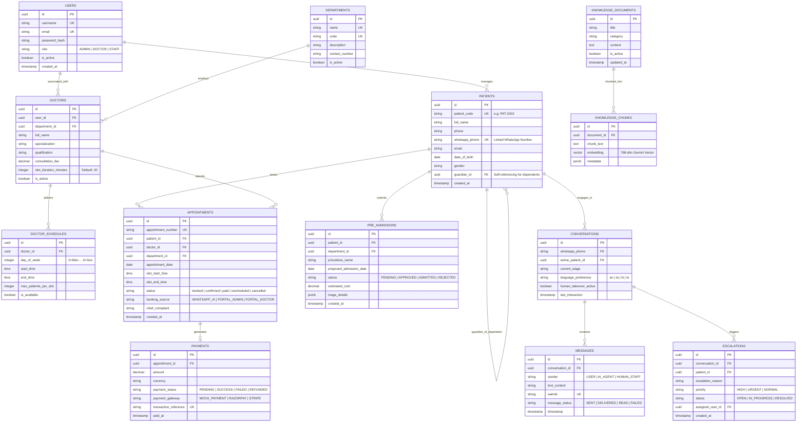

# Software Design Document (SDD)
## Integration of Meridian Hospital AI Patient Desk POC with Hospital Management Portal

**Document Version:** 1.0.0  
**Author:** Antigravity AI Engineering Team  
**Status:** Design Phase (No Code Modifications Executed)  

---

## 1. Executive Summary & Core Integration Principles

This Software Design Document (SDD) specifies the architectural blueprint, data model harmonization, and module integration strategy for merging the **Meridian Hospital AI Patient Desk POC** with the **Hospital Management Portal**.

### 1.1 Core Guiding Principles

1. **Non-Destructive Integration (Preserve Friend's Portal)**:
   - We **DO NOT** rebuild, replace, or duplicate any existing modules in the Hospital Management Portal.
   - Where duplicate concepts exist, the existing Hospital Management Portal UI, components, and user workflows are preserved as the master interface. Meridian POC data is mapped directly into these existing structures.

2. **Strict WhatsApp Engine Protection (Protected System Contract)**:
   - The WhatsApp Patient Desk is a **protected, isolated subsystem**.
   - Meta WhatsApp Cloud API integrations, Webhook endpoints, LLM Intent Router, Gemini engine, State Manager, Multilingual processing, STT/TTS voice pipeline, RAG retriever, and WhatsApp state machines remain 100% untouched.
   - The WhatsApp system interacts with the merged application strictly via the common data access layer and shared FastAPI backend services.

3. **Strict Categorization Framework (Category A, B, C, D)**:
   - **Category A (Same Module + Same Functionality)**: Retain friend's UI/workflow; integrate Meridian data into friend's existing implementation.
   - **Category B (Same Module + Partially Different Functionality)**: Retain friend's functionality; identify and add ONLY missing features from Meridian POC without breaking existing behaviors.
   - **Category C (POC-Exclusive Functionality)**: Build missing POC features (e.g., AI Escalations, Live Bot Handoff, Knowledge RAG Admin) directly into friend's portal using friend's UI/UX design tokens.
   - **Category D (Friend Portal-Exclusive Functionality)**: Preserve friend's functionality (e.g., Claims RCM, Radiology Triage, Bed Forecasting) completely untouched.

---

## 2. High-Level Target Architecture

```mermaid
graph TD
    subgraph "External Touchpoints"
        WA["WhatsApp User (Patient)"]
        ADMIN["Hospital Admin (Web Portal)"]
        DOC["Doctor (Web Portal)"]
    end

    subgraph "Protected WhatsApp AI Engine"
        META["Meta WhatsApp Cloud API"]
        HOOK["FastAPI Webhook (/api/whatsapp/webhook)"]
        INTENT["LLM Intent Router & State Engine (Gemini 3.5)"]
        RAG["RAG Retriever & Knowledge Vector Store"]
        VOICE["Voice/STT/TTS Service"]
    end

    subgraph "Hospital Management Web Portal (Unified UI)"
        AP_LAYOUT["Unified App Layout & Auth Provider"]
        
        subgraph "Admin Portal Modules"
            M_PAT["Patient Management (Category A)"]
            M_DOC["Doctor & Schedule Management (Category B)"]
            M_APT["Appointment Management (Category B)"]
            M_ESC["AI Patient Desk & Human Handoff (Category C)"]
            M_PRE["Pre-Admission Triage (Category C)"]
            M_KNOW["AI Knowledge Base Management (Category C)"]
            M_RPT["Unified Reports & Analytics (Category B)"]
            M_RCM["RCM Claims & Bed Allocation (Category D)"]
        end

        subgraph "Doctor Portal Modules"
            M_DDASH["Doctor Dashboard (Category A)"]
            M_DPAT["My Patients & Clinical Notes (Category B)"]
            M_DESC["Doctor AI Escalation Inbox (Category C)"]
        end
    end

    subgraph "Common Backend Layer (FastAPI)"
        AUTH["Auth Service & JWT Access Control"]
        PAT_SVC["Patient Service"]
        APT_SVC["Appointment Service"]
        PRE_SVC["Pre-Admission Service"]
        KNOW_SVC["Knowledge Service"]
        NOTIF_SVC["Email & WhatsApp Notification Dispatcher"]
    end

    subgraph "Common Data Layer (PostgreSQL)"
        DB[("PostgreSQL Unified Database
        - patients / patient_dependents
        - doctors / doctor_schedules
        - appointments / payments
        - pre_admissions / patient_reports
        - conversations / messages / escalations
        - knowledge_documents / knowledge_chunks
        - audit_logs / users / roles")]
    end

    %% Touchpoint Connections
    WA --> META
    META --> HOOK
    HOOK --> INTENT
    INTENT --> RAG
    INTENT --> VOICE
    ADMIN --> AP_LAYOUT
    DOC --> AP_LAYOUT

    %% Protected Engine to Common Data Layer
    INTENT --> PAT_SVC
    INTENT --> APT_SVC
    INTENT --> PRE_SVC
    INTENT --> KNOW_SVC

    %% Portal Modules to Common Backend
    M_PAT & M_DOC & M_APT & M_ESC & M_PRE & M_KNOW & M_RPT & M_RCM --> Common Backend Layer
    M_DDASH & M_DPAT & M_DESC --> Common Backend Layer

    %% Backend Services to DB
    PAT_SVC & APT_SVC & PRE_SVC & KNOW_SVC & AUTH --> DB
```

---

## 3. Module Categorization & Integration Blueprint

### 3.1 Admin Portal Modules Mapping

| Module Name | Meridian POC Feature Set | Friend Portal Feature Set | Category | Integration & Mapping Action Plan |
| :--- | :--- | :--- | :---: | :--- |
| **Patient Management** | Multi-patient per WhatsApp number, Dependent linkage, WhatsApp ID tracking, Full Patient Profiles. | Standard Patient List, Search, Patient Details View. | **Category A** | **Preserve Friend's UI & Table Components.** Extend database mapping so friend's Patient table displays both walk-in & WhatsApp-registered patients. Expose dependent relationships and WhatsApp Phone numbers inside friend's existing patient drawer/modal. |
| **Doctor & Schedule Management** | Doctor listing, Specialization mapping, Dynamic time slot generation, Date-wise schedule rules. | Doctor Directory, Working Hours setup. | **Category B** | **Preserve Friend's Doctor Management UI.** Add Meridian's dynamic slot generation algorithm behind the existing schedule creation modal. Allow admins to configure interactive slot durations and max concurrent patients per slot. |
| **Appointment Management** | Dynamic booking, Status tracking (`booked`, `confirmed`, `paid`, `rescheduled`, `cancelled_by_patient`), Mock payment sync. | Appointment List, Calendar View, Basic Status update (`scheduled`, `completed`, `cancelled`). | **Category B** | **Preserve Friend's Appointment List & Calendar Views.** Augment status enums to include AI-specific booking states (`AI-Booked`, `Payment Pending`, `Confirmed via WhatsApp`, `Rescheduled by Patient`). Synchronize status changes bidirectionally so staff updates instantly notify WhatsApp patients. |
| **AI Patient Desk & Human Handoff** | Live WhatsApp conversation stream, Bot takeover toggle, Direct staff chat dispatch, Escalation triggers. | *None* | **Category C** | **Add New Module into Friend's Navigation Sidebar** under "AI Patient Desk". Styled strictly using Friend's UI component system. Displays active AI conversations, intent logs, sentiment flags, and human agent takeover toggle. |
| **Pre-Admission Triage** | Emergency surgical pre-admission forms, Guardian consent, Estimated Cost breakdown, Document upload. | *None* | **Category C** | **Add New Module into Friend's Admin Navigation** under "Pre-Admissions". Uses Friend's table/modal components. Populated automatically when patients complete pre-admission via WhatsApp or Web. |
| **AI Knowledge Base & RAG Admin** | Hospital FAQs, Department contacts, RAG vector chunking, Grounding document management. | Basic Hospital Info page. | **Category C** | **Enhance Hospital Settings Page in Friend's Portal.** Add a "Knowledge Base & AI Grounding" tab where admins can manage hospital services, department extensions, and FAQ chunks used by the WhatsApp AI agent. |
| **Reports & Analytics** | AI resolution metrics, WhatsApp vs Voice channel split, Language distribution, Payment conversions. | Patient volume & basic financial summary reports. | **Category B** | **Preserve Friend's Reports Dashboard.** Add an "AI Desk Analytics" section featuring channel performance widgets, conversion rates, and automated bot vs human resolution charts. |
| **Revenue Cycle (RCM) & Bed Allocation** | *None (Mock data only)* | Full Claims Processing, Bed Forecast & Radiology Triage. | **Category D** | **Preserve Friend's Implementation Unmodified.** Retain all existing RCM, Radiology Triage, and Bed Allocation pages and services without altering any existing logic. |

---

### 3.2 Doctor Portal Modules Mapping

| Module Name | Meridian POC Feature Set | Friend Portal Feature Set | Category | Integration & Mapping Action Plan |
| :--- | :--- | :--- | :---: | :--- |
| **Doctor Dashboard** | Today's appointment counts, Quick status updates. | Doctor KPI Cards, Daily Schedule, Next Patient preview. | **Category A** | **Preserve Friend's Doctor Dashboard UI.** Feed unified appointment data (combining WhatsApp AI bookings and direct portal walk-ins) into friend's existing dashboard components. |
| **My Patients & Clinical Records** | Patient summary, Past appointments, Reports viewer. | Clinical Notes, Prescription builder, Patient Medical History. | **Category B** | **Preserve Friend's EMR & Clinical Notes View.** Add a tab/section inside friend's Patient Medical Record modal to display WhatsApp AI pre-consultation symptom summaries and pre-uploaded lab/radiology reports. |
| **AI Patient Requests Inbox** | Staff notification for escalated queries, Direct response dispatch. | *None* | **Category C** | **Add "AI Escalations" Tab to Doctor Workspace.** Allows doctors to view high-priority clinical inquiries escalated by the WhatsApp AI engine and send direct text replies back to the patient's WhatsApp chat. |

---

## 4. Database Schema Harmonization Plan

To support both the **Protected WhatsApp Engine** and the **Hospital Management Portal**, the unified database schema merges all entities into PostgreSQL while maintaining 100% backward compatibility.



---

## 5. Protected WhatsApp Engine Isolation Contract

To comply with the **Non-Negotiable WhatsApp Requirement**, the WhatsApp AI pipeline operates as an independent service domain within the unified FastAPI backend.

```
                              ┌──────────────────────────────────────────────┐
                              │         META WHATSAPP CLOUD INFRA            │
                              └──────────────────────┬───────────────────────┘
                                                     │ Webhook Events (POST)
                                                     ▼
┌─────────────────────────────────────────────────────────────────────────────────────────────────────────────┐
│ PROTECTED WHATSAPP AI ENGINE LAYER (UNTOUCHED)                                                              │
│                                                                                                             │
│  ┌─────────────────────────────┐    ┌─────────────────────────────┐    ┌─────────────────────────────┐  │
│  │ Webhook Receiver & Verify   │───>│ Message Aggregator & Queue  │───>│ Language & Speech Service   │  │
│  │ (/api/whatsapp/webhook)     │    │ (State Deduplication)       │    │ (STT / TTS Multilingual)    │  │
│  └─────────────────────────────┘    └─────────────────────────────┘    └─────────────────────────────┘  │
│                                                                                       │                     │
│                                                                                       ▼                     │
│  ┌─────────────────────────────┐    ┌─────────────────────────────┐    ┌─────────────────────────────┐  │
│  │ State & Context Manager     │<──>│ LLM Intent Router           │<──>│ RAG Knowledge Retriever     │  │
│  │ (Active Patient & Stage)    │    │ (Gemini 3.5 Engine)         │    │ (Vector Search)             │  │
│  └─────────────────────────────┘    └─────────────────────────────┘    └─────────────────────────────┘  │
└────────────────────────────────────────────────────┬────────────────────────────────────────────────────────┘
                                                     │ Direct DB ORM / Shared Service Access
                                                     ▼
┌─────────────────────────────────────────────────────────────────────────────────────────────────────────────┐
│ COMMON HOSPITAL DATA LAYER (PostgreSQL)                                                                     │
│                                                                                                             │
│  [patients]  │  [doctors]  │  [appointments]  │  [pre_admissions]  │  [conversations]  │  [escalations]  │
└─────────────────────────────────────────────────────────────────────────────────────────────────────────────┘
```

### 5.1 Immutable Component Checklist
- **API Endpoint**: `POST /api/whatsapp/webhook` & `GET /api/whatsapp/webhook` (Verification) remain strictly intact.
- **LLM Pipeline**: `agent/llm_intent_router.py`, `agent/intent_detector.py`, `agent/entity_extractor.py`, `agent/agent_service.py` operate without structural changes.
- **Interactive Messaging**: WhatsApp interactive list buttons, date pickers, timeslot selectors, blue-tick updates, and payment link flows retain exact current logic.
- **Data Integration Boundary**: When a patient completes booking or pre-admission via WhatsApp, the AI engine invokes shared `appointment_service.py` or `preadmission_service.py` to write into the unified PostgreSQL database.

---

## 6. Detailed Implementation & Verification Plan

### Phase 1: Common Data Access & Schema Alignment (No UI Changes)
1. Verify unified PostgreSQL migration scripts (`001_create_roles.sql` through `022_cleanup_dummy_departments.sql`).
2. Ensure both WhatsApp AI service and FastAPI Portal REST routes reference the common database models (`models.py`).

### Phase 2: Category A & Category B Backend API Integration
1. Extend `dashboard_routes.py` to serve unified data (combining WhatsApp AI bookings with manual portal bookings) to Friend's existing frontend pages.
2. Confirm that updates made in Friend's Doctor/Appointment management pages emit instant DB updates visible to WhatsApp status queries.

### Phase 3: Category C Front-End Additions (Portal Styling Compliance)
1. Build the **AI Patient Desk & Human Handoff** view inside Friend's portal sidebar, inheriting Friend's exact CSS design system, typography, color palette, and layout wrappers (`AppLayout`).
2. Build the **Pre-Admission Triage** and **Knowledge Base Admin** modules inside Friend's navigation layout.
3. Add the **AI Escalations Inbox** tab to the Doctor Portal.

### Phase 4: System Verification & Acceptance Testing
- **Automated Verification**:
  - Run frontend production build (`npm run build`) to ensure zero TypeScript or bundling issues.
  - Run backend syntax and module validation (`python -m py_compile`).
- **End-to-End Simulation**:
  - Perform simulated WhatsApp booking flow -> Verify appointment appears instantly in Friend's Admin & Doctor Portals.
  - Update appointment status in Friend's Doctor Portal -> Verify WhatsApp patient receives automatic status notification.
